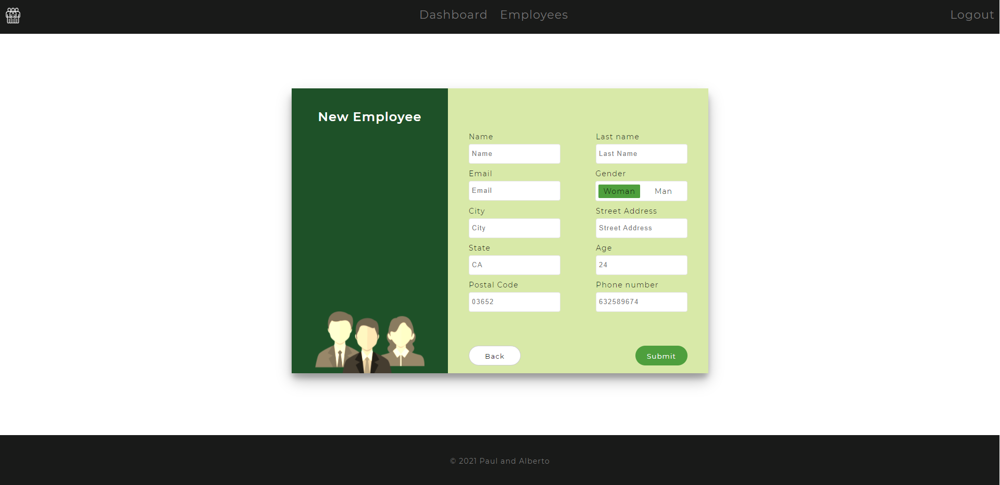

# PHP-employee-management-v1

CRUD of employees over a json file, handling encrypted passwords, and connecting with external Web Services from the server in order to get the employee avatar.

## Lessons Learned

● Improve your knowledge of session variables in PHP.

● Learn to create a login page.

● Handle the session throughout all pages.

● Learn to connect with external Web Services.

● Learn to handle encrypted data.

● Improve your knowledge of reading and writing JSON files.

● Improve your knowledge of AJAX.

● Learn to work with a predefined structure.

## Demo

https://github.com/badyalberto/php-employee-management-v1

## Authors

- [@paulMolano](https://github.com/paulMolano)
- [@badyalberto](https://github.com/badyalberto)

## Screenshots

